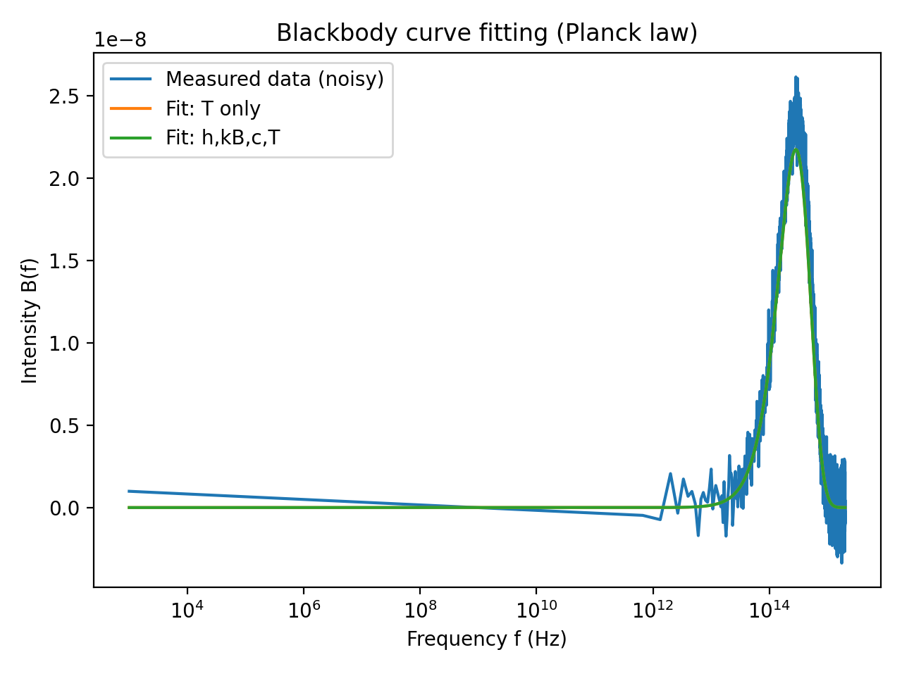

# Curve Fitting & Parameter Estimation (Python)

This project explores curve fitting and parameter estimation using real datasets,
with an emphasis on least-squares modeling, signal decomposition, and nonlinear
physical models.

The goal is not only to fit curves, but to extract meaningful parameters from
noisy data and justify the modeling choices.

---

## Dataset 1: Linear Regression with Noise

**Objective**  
Estimate the slope and intercept of a noisy straight-line dataset using least squares.

**Method**
- Constructed the design matrix \( M = [1 \ \ x] \)
- Solved normal equations \( (M^TM)^{-1}M^Ty \)
- Estimated noise from residuals
- Visualized uncertainty using sparse error bars

**Result**


File: `D1/curve1.py`

---

## Dataset 2: Sum of Two Sine Waves

**Objective**  
Estimate the amplitudes of two sinusoidal components with periods \(T\) and \(3T\).

**Method**
- Estimated fundamental frequency using FFT peak detection
- Built a linear least-squares model using sine/cosine basis functions
- Extracted amplitudes from fitted coefficients
- Validated results using nonlinear `curve_fit`

**Key Insight**
Least squares provided fast, stable amplitude estimates, while `curve_fit`
served as a verification step with explicit phase modeling.

**Result**


File: `D2/curve2.py`

---

## Dataset 3: Blackbody Radiation (Planck Law)

**Objective**  
Estimate the temperature of a blackbody radiator from simulated spectral data.

**Method A**
- Used known physical constants (\(h, k_B, c\))
- Estimated temperature using nonlinear curve fitting

**Method B**
- Estimated \(h, k_B, c,\) and \(T\) simultaneously
- Observed numerical sensitivity and parameter trade-offs

**Key Insight**
Physically informed constraints and good initial estimates are essential for
stable nonlinear fitting of real-world models.

**Result**


File: `D3/curve3.py`

---

## Requirements

- Python 3.x
- NumPy
- SciPy
- Matplotlib

Install dependencies:
```bash
pip install numpy scipy matplotlib
